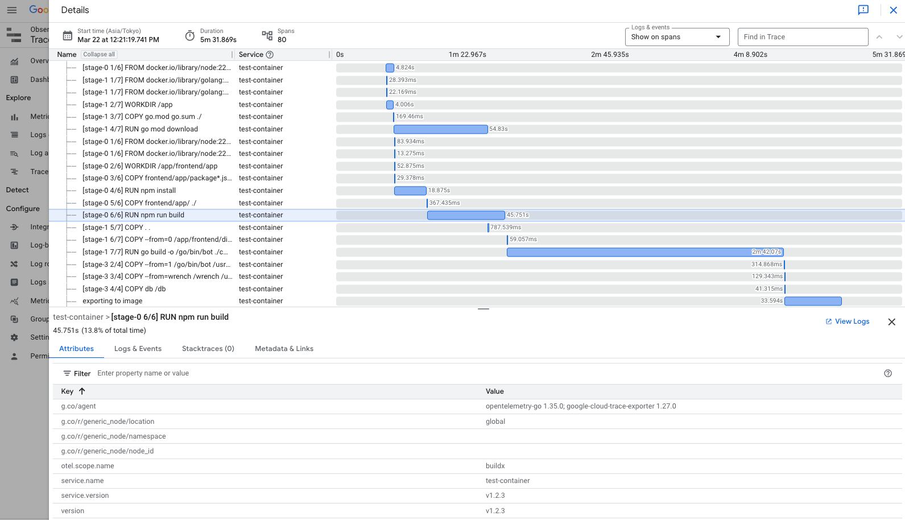

# Buildx Telemetry


[](https://github.com/sakajunquality/buildx-telemetry/actions/workflows/ci.yml)


A tool for converting Docker Buildx logs to OpenTelemetry traces.




## Overview

This application consumes Docker Buildx log output in the `rawjson` format and exports the build steps as OpenTelemetry traces. This allows you to view your Docker build steps in your favorite OpenTelemetry tracing visualization tool.

## Installation

### Go install

```bash
go install github.com/sakajunquality/buildx-telemetry/cmd@latest
```

## Usage

Pipe the output of a Docker build command with `--progress=rawjson` to the application:

```bash
docker buildx build --progress=rawjson . 2>&1 | buildx-telemetry
```

Or use a pre-recorded log file:

```bash
buildx-telemetry --input=build-log.json
```

### Options

- `--otlp-endpoint`: OpenTelemetry endpoint (default: "localhost:4317")
- `--service-name`: Service name for telemetry (default: "docker-build-telemetry")
- `--debug`: Enable debug mode to print detailed step information
- `--input`: Input file (defaults to stdin)
- `--log-level`: Set the logging level (debug, info, warn, error) (default: "info")
- `--exit-code-on-error`: Exit code to use when an error occurs (default: 1)
- `--trace-context`: W3C Trace Context header for distributed tracing (default: empty)
- `--version`: Version information to add to the trace (default: empty)
- `--v`: Show buildx-telemetry version information and exit

## Development

Clone the repository:

```bash
git clone https://github.com/sakajunquality/buildx-telemetry.git
cd buildx-telemetry
```

Build the application:

```bash
go build -o buildx-telemetry ./cmd
```

## CI/CD

The project uses GitHub Actions for continuous integration and delivery:

- **CI Pipeline**: Runs on every push and pull request to main branch
  - Linting with golangci-lint
  - Running tests with race detector and coverage reporting
  - Building the application


## Logging

The application uses structured logging with the Zap library. By default, logs are output in JSON format for production use, but in development mode (--debug), they are output in a more human-readable format.

You can control the log level with the `--log-level` flag:

```bash
buildx-telemetry --log-level=debug
```

## Error Handling

When an error occurs, the application logs the error details and exits with the specified exit code. You can control the exit code using the `--exit-code-on-error` flag:

```bash
buildx-telemetry --exit-code-on-error=2
```

Setting `--exit-code-on-error=0` will make the application continue with exit code 0 even when errors occur, which can be useful in CI/CD pipelines where you want to avoid failing the pipeline.

## Distributed Tracing

The application supports W3C Trace Context for distributed tracing. This allows you to integrate the build traces with a larger trace context from your CI/CD pipeline or other systems.

To link the build traces to a parent trace:

```bash
buildx-telemetry --trace-context="00-4bf92f3577b34da6a3ce929d0e0e4736-00f067aa0ba902b7-01"
```

The trace context format follows the [W3C Trace Context specification](https://www.w3.org/TR/trace-context/), which includes:
- Trace ID (16 bytes)
- Parent Span ID (8 bytes)
- Trace flags

When a valid trace context is provided, the build traces will be created as child spans of the parent trace, creating a complete distributed trace visualization.

## Version Tracking

You can add version information to your traces, which is useful for tracking builds across different versions of your software. The version is added as an attribute to all spans created by the application.

```bash
buildx-telemetry --version="v1.2.3"
```

This version information will appear in your trace visualization tool, making it easier to filter or analyze traces by version.

## Example

1. Start a local OpenTelemetry collector (e.g., Jaeger)
2. Run a Docker build with the `rawjson` output:

```bash
docker buildx build --progress=rawjson . 2>&1 | buildx-telemetry --version="v1.2.3"
```

3. Open your tracing UI (e.g., Jaeger UI) to view the build steps as traces.

## License

[MIT](LICENSE) 
